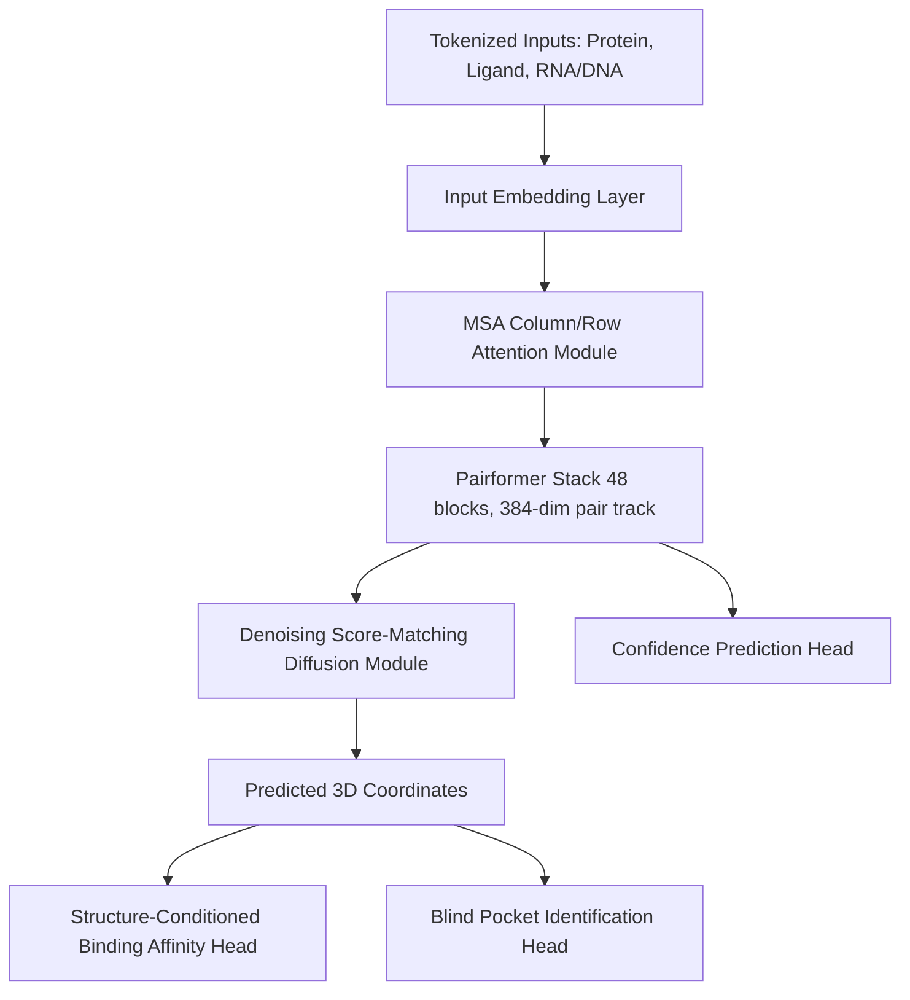

# IsoDDE Architecture Overview

The Isomorphic Labs Drug Design Engine (IsoDDE) is a unified architecture designed to predict biomolecular structures, interactions, binding affinities, and ligand-binding pockets in a single end-to-end differentiable system.

## Key Architectural Components

### 1. Trunk and Representation Improvements (Section 1.1)
- **Outer Product Mean (OPM) Reordering**: The OPM module is computed *before* row attention, improving single-to-pair representation information flow (inspired by Wohlwend et al., ByteDance AML 2025).
- **Wider Pair Representations**: Pair representations are expanded to 384-dimensions (from AlphaFold 3's 128-dimensions) following SeedFold (Zhou et al., 2025).
- **Memory-Efficient Triangular Attention**: Self-attention along the starting and ending node axes supports FlashAttention-style O(n²) chunking to process long complexes.

### 2. Denoising Score-Matching Diffusion (Section 1.1)
- Variance-exploding (VE) score matching schedule generating 3D coordinates from standard Gaussian noise.
- Iterative sampling via variance-exploding DDPM updates.
- Robust stereochemical filtering during multi-seed ranking.

### 3. Binding Affinity (Section 2)
- Structure-conditioned binding free energy ($\Delta G$) prediction using radial basis function (RBF) spatial distance features.
- Trained using Pearson correlation-aware loss with per-assay normalization to combine heterogeneous experimental inputs (Kd, Ki, IC50).

### 4. Pocket Identification (Section 3)
- Residue-level probability classification identifies binding pockets blind to ligand identity.
- Single-linkage clustering at a 5 Å threshold groups pocket residues and filters small candidate sites (< 10 residues).
